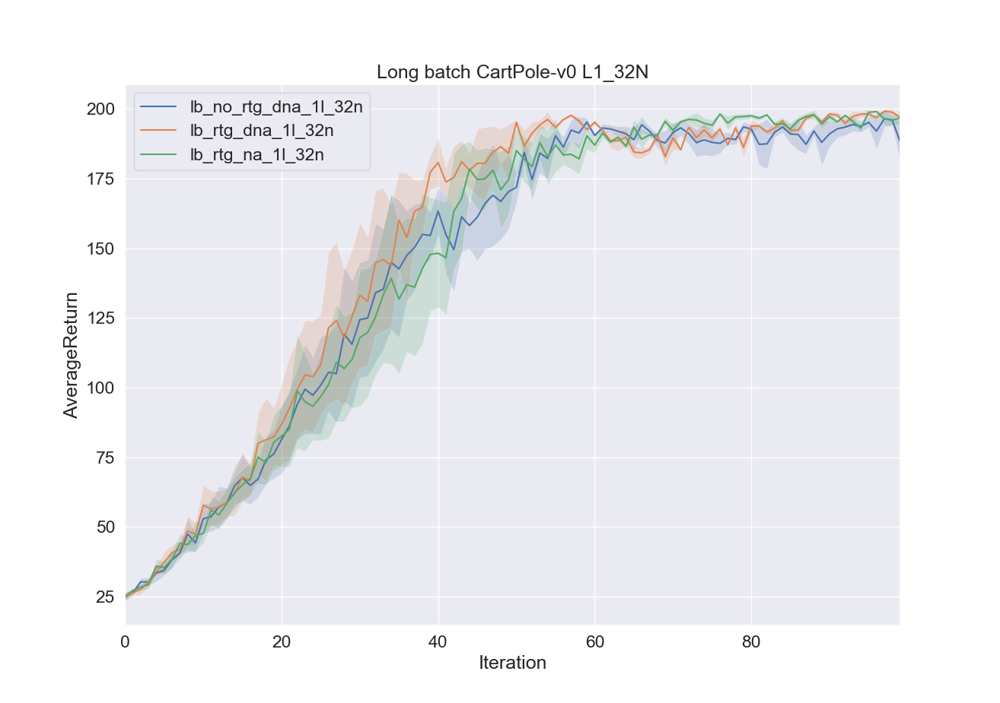

# Problem 5
### Running Exercise 5 tasks with 1 hidden layer and 32 neurons:
```bash
python train_pg_f18.py CartPole-v0 -n 100 -b 1000 --n_layers 1 --size 32 -e 3 -dna --exp_name sb_no_rtg_dna_1l_32n
python train_pg_f18.py CartPole-v0 -n 100 -b 1000 --n_layers 1 --size 32 -e 3 -rtg -dna --exp_name sb_rtg_dna_1l_32n
python train_pg_f18.py CartPole-v0 -n 100 -b 1000 --n_layers 1 --size 32 -e 3 -rtg --exp_name sb_rtg_na_1l_32n
python train_pg_f18.py CartPole-v0 -n 100 -b 5000 --n_layers 1 --size 32 -e 3 -dna --exp_name lb_no_rtg_dna_1l_32n
python train_pg_f18.py CartPole-v0 -n 100 -b 5000 --n_layers 1 --size 32 -e 3 -rtg -dna --exp_name lb_rtg_dna_1l_32n
python train_pg_f18.py CartPole-v0 -n 100 -b 5000 --n_layers 1 --size 32 -e 3 -rtg --exp_name lb_rtg_na_1l_32n
```

### Ploting the results:
#### Short Batch
```bash
# Get the names of all results files
export RESULTS=`ls ./. | grep sb_ | sed ':a;N;$!ba;s/\n/ /g'`
python3 ../plot.py $RESULTS --value AverageReturn --title "Short batch CartPole-v0 L1_32N"
```


#### Long Batch
```bash
# Get the names of all results files
export RESULTS=`ls ./. | grep lb_ | sed ':a;N;$!ba;s/\n/ /g'`
python3 ../plot.py $RESULTS --value AverageReturn --title "Long batch CartPole-v0 L1_32N"
```


### Questions

1. Which gradient estimator has better performance without advantage-centering— the trajectory-centric one, or the one using reward-to-go?

<span style="color:blue"> Without average advantage-centering, the reward to go was much faster to converge.
On the smaller batch, the reward to go performed significantly better and converged to a better average result with less variance.
At the very last iterations, the rtg average was decrease and the performance were closes to the no rtg, but this might only be due to noise.)</span>

2. Did advantage centering help?

<span style="color:blue"> It seems to help at converging to a slightly better and a more stable average value (reduces the variance).</span>

3. Did the batch size make an impact?

<span style="color:blue">  Yes, longer batches converge faster and seem to have lower variance.</span>

# Problem 6: InvertedPendulum-v2
<!-- ```bash -->
<!-- export b=2000; export lr=0.001; -->
<!-- python train_pg_f18.py InvertedPendulum-v2 -ep 1000 --discount 0.9 -n 100 -e 3 -l 2 -s 64 -b $b -lr $lr -rtg --exp_name hc_b${b}_lr${lr} -->

<!-- #export cmd="python3 train_pg_f18.py InvertedPendulum-v2 -ep 1000 --discount 0.9 -n 100 -e 3 -l 2 -s 64 -b $b -lr $lr -rtg --exp_name hc_b$b_lr$lr" -->
<!-- #echo $cmd -->
<!-- #bash -c $cmd -->
<!-- #python train_pg_f18.py InvertedPendulum-v2 -ep 1000 --discount 0.9 -n 100 -e 3 -l 2 -s 64 -b 2000 -lr 0.001 -rtg --exp_name hc_b<b*>_r<r*> -->
<!-- ``` -->
### Task
Your task is to find the smallest batch size b* and largest learning rate r* that gets to optimum (maximum score of 1000) in less than 100 iterations.
The policy performance may fluctuate around 1000 – this is fine. The precision of b* and r* need only be one significant digit.

Note: I did not manage to find any learning rate that doesn't significantly fluctuate around 1000.
So I just reported the best results parameters given a grid search, where only modifying a single parameter at a time.
Please note that a grid search is not the optimal choice for searching meta parameters, because one parameter might be more significant then the others.
  ([Random Search for Hyper-Parameter Optimization](http://www.jmlr.org/papers/volume13/bergstra12a/bergstra12a.pdf))


First, keeping the batch constant (2000) and trying to modify the learning rate:
```bash
# Keeping batch size constant (2000) and modifying the learning rate
python train_pg_f18.py RoboschoolInvertedPendulum-v1 -ep 1000 --discount 0.9 -n 100 -e 3 -l 2 -s 64 -b 2000 -lr 0.001 -rtg --exp_name hc_b2000_r0.001
python train_pg_f18.py RoboschoolInvertedPendulum-v1 -ep 1000 --discount 0.9 -n 100 -e 3 -l 2 -s 64 -b 2000 -lr 0.005 -rtg --exp_name hc_b2000_r0.005
python train_pg_f18.py RoboschoolInvertedPendulum-v1 -ep 1000 --discount 0.9 -n 100 -e 3 -l 2 -s 64 -b 2000 -lr 0.008 -rtg --exp_name hc_b2000_r0.008
python train_pg_f18.py RoboschoolInvertedPendulum-v1 -ep 1000 --discount 0.9 -n 100 -e 3 -l 2 -s 64 -b 2000 -lr 0.009 -rtg --exp_name hc_b2000_r0.009
python train_pg_f18.py RoboschoolInvertedPendulum-v1 -ep 1000 --discount 0.9 -n 100 -e 3 -l 2 -s 64 -b 2000 -lr 0.01 -rtg --exp_name hc_b2000_r0.01
python train_pg_f18.py RoboschoolInvertedPendulum-v1 -ep 1000 --discount 0.9 -n 100 -e 3 -l 2 -s 64 -b 2000 -lr 0.011 -rtg --exp_name hc_b2000_r0.011
python train_pg_f18.py RoboschoolInvertedPendulum-v1 -ep 1000 --discount 0.9 -n 100 -e 3 -l 2 -s 64 -b 2000 -lr 0.012 -rtg --exp_name hc_b2000_r0.012
python train_pg_f18.py RoboschoolInvertedPendulum-v1 -ep 1000 --discount 0.9 -n 100 -e 3 -l 2 -s 64 -b 2000 -lr 0.015 -rtg --exp_name hc_b2000_r0.015
```


Its seems like the best learning rate is 0.01. Lets now try to too keep it constant and modify the batch size.

```bash
# Keeping the learning rate constant (0.01) and modifying the batch size
python train_pg_f18.py RoboschoolInvertedPendulum-v1 -ep 1000 --discount 0.9 -n 100 -e 3 -l 2 -s 64 -b 1000 -lr 0.01 -rtg --exp_name hc_b1000_r0.01
python train_pg_f18.py RoboschoolInvertedPendulum-v1 -ep 1000 --discount 0.9 -n 100 -e 3 -l 2 -s 64 -b 1500 -lr 0.01 -rtg --exp_name hc_b1500_r0.01
python train_pg_f18.py RoboschoolInvertedPendulum-v1 -ep 1000 --discount 0.9 -n 100 -e 3 -l 2 -s 64 -b 3000 -lr 0.01 -rtg --exp_name hc_b3000_r0.01
python train_pg_f18.py RoboschoolInvertedPendulum-v1 -ep 1000 --discount 0.9 -n 100 -e 3 -l 2 -s 64 -b 4000 -lr 0.01 -rtg --exp_name hc_b4000_r0.01

python train_pg_f18.py RoboschoolInvertedPendulum-v1 -ep 1000 --discount 0.9 -n 100 -e 3 -l 2 -s 64 -b 1500 -lr 0.01 -rtg --exp_name hc_b1500_r0.01
python train_pg_f18.py RoboschoolInvertedPendulum-v1 -ep 1000 --discount 0.9 -n 100 -e 3 -l 2 -s 64 -b 2500 -lr 0.01 -rtg --exp_name hc_b2500_r0.01
```


### Show the graphs:
```bash
export RESULTS=`ls ./. | grep hc_b | sed ':a;N;$!ba;s/\n/ /g'`
python3 ../plot.py $RESULTS --value AverageReturn --title "RoboschoolInvertedPendulum-v1"
```

# Problem 7: LunarLander
```bash
# Fix the error: "AttributeError: module 'Box2D._Box2D' has no attribute 'RAND_LIMIT'"
# Run on docker:
pip3 install box2d box2d-kengz --user

# Copy the new 'lunar_lander.py' file
cd /usr/local/lib/python3.5/dist-packages/gym/envs/box2d
mv lunar_lander.py lunar_lander_orig.py
cp /tf/srv/hw2/lunar_lander.py lunar_lander.py

# Run the tasks:
python train_pg_f18.py LunarLanderContinuous-v2 -ep 1000 --discount 0.99 -n 100 -e 3 -l 2 -s 64 -b 40000 -lr 0.005 -rtg --nn_baseline --exp_name ll_b40000_r0.005
```

### Show the graph:
```bash
python3 ../plot.py ll_b40000_r0.005_LunarLanderContinuous-v2_21-07-2019_09-59-05 --value AverageReturn --title "Lunar Lander (lr 0.005)"
```


# Problem 8: HalfCheetah
Work is still in progress for this task - the agent did not manage to gain high reward on the 'RoboschoolHalfCheetah-v1' environment.
```bash
python train_pg_f18.py RoboschoolHalfCheetah-v1 -ep 150 --discount 0.9 -n 100 -e 3 -l 2 -s 32 -b 10000 -lr 0.005 -rtg --nn_baseline --exp_name hc_b10000_r0.005
python train_pg_f18.py RoboschoolHalfCheetah-v1 -ep 150 --discount 0.9 -n 100 -e 3 -l 2 -s 32 -b 10000 -lr 0.01 -rtg --nn_baseline --exp_name hc_b10000_r0.01
python train_pg_f18.py RoboschoolHalfCheetah-v1 -ep 150 --discount 0.9 -n 100 -e 3 -l 2 -s 32 -b 10000 -lr 0.02 -rtg --nn_baseline --exp_name hc_b10000_r0.02
python train_pg_f18.py RoboschoolHalfCheetah-v1 -ep 150 --discount 0.9 -n 100 -e 3 -l 2 -s 32 -b 30000 -lr 0.005 -rtg --nn_baseline --exp_name hc_b30000_r0.005
python train_pg_f18.py RoboschoolHalfCheetah-v1 -ep 150 --discount 0.9 -n 100 -e 3 -l 2 -s 32 -b 30000 -lr 0.01 -rtg --nn_baseline --exp_name hc_b30000_r0.01
python train_pg_f18.py RoboschoolHalfCheetah-v1 -ep 150 --discount 0.9 -n 100 -e 3 -l 2 -s 32 -b 30000 -lr 0.02 -rtg --nn_baseline --exp_name hc_b30000_r0.02
python train_pg_f18.py RoboschoolHalfCheetah-v1 -ep 150 --discount 0.9 -n 100 -e 3 -l 2 -s 32 -b 50000 -lr 0.005 -rtg --nn_baseline --exp_name hc_b50000_r0.005
python train_pg_f18.py RoboschoolHalfCheetah-v1 -ep 150 --discount 0.9 -n 100 -e 3 -l 2 -s 32 -b 50000 -lr 0.01 -rtg --nn_baseline --exp_name hc_b50000_r0.01
python train_pg_f18.py RoboschoolHalfCheetah-v1 -ep 150 --discount 0.9 -n 100 -e 3 -l 2 -s 32 -b 50000 -lr 0.02 -rtg --nn_baseline --exp_name hc_b50000_r0.02
```
