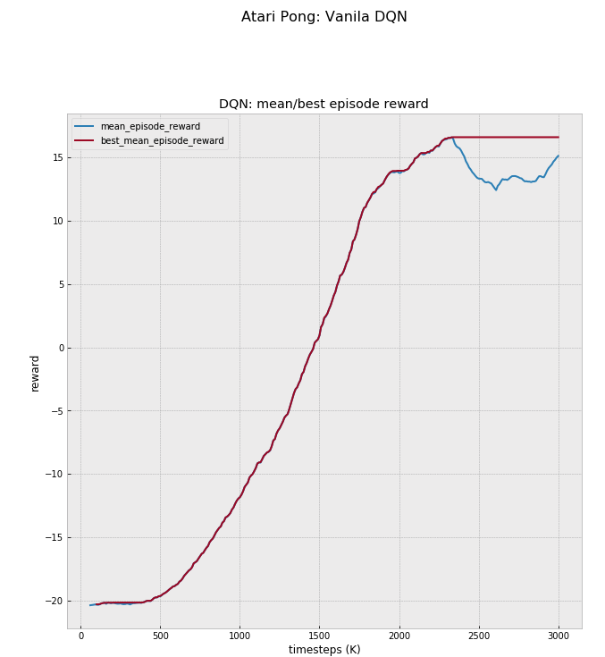
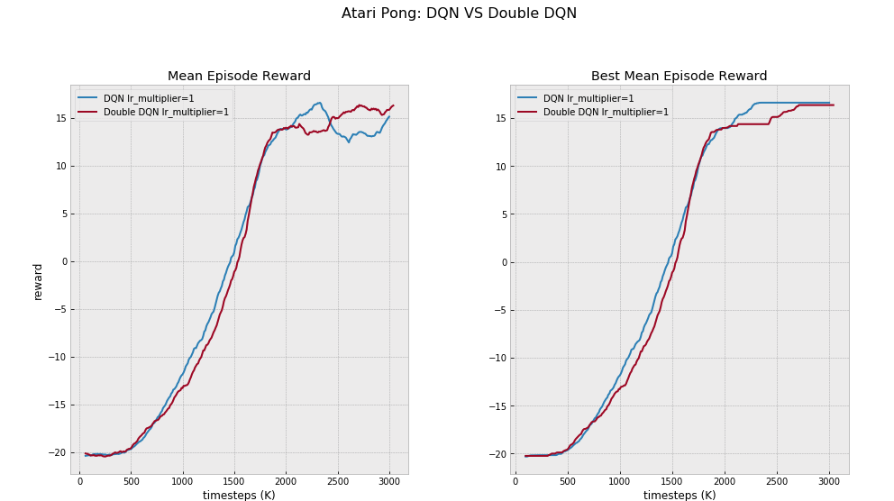
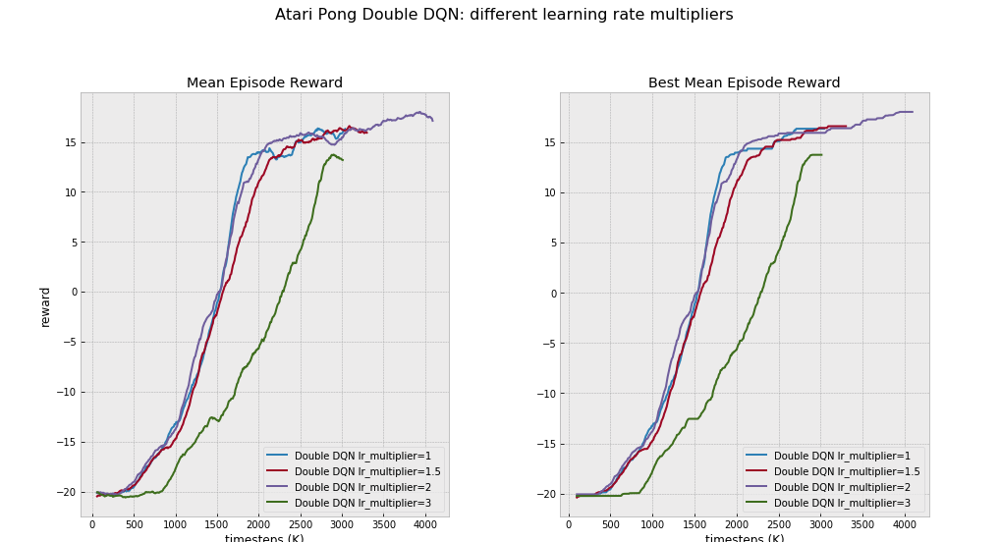
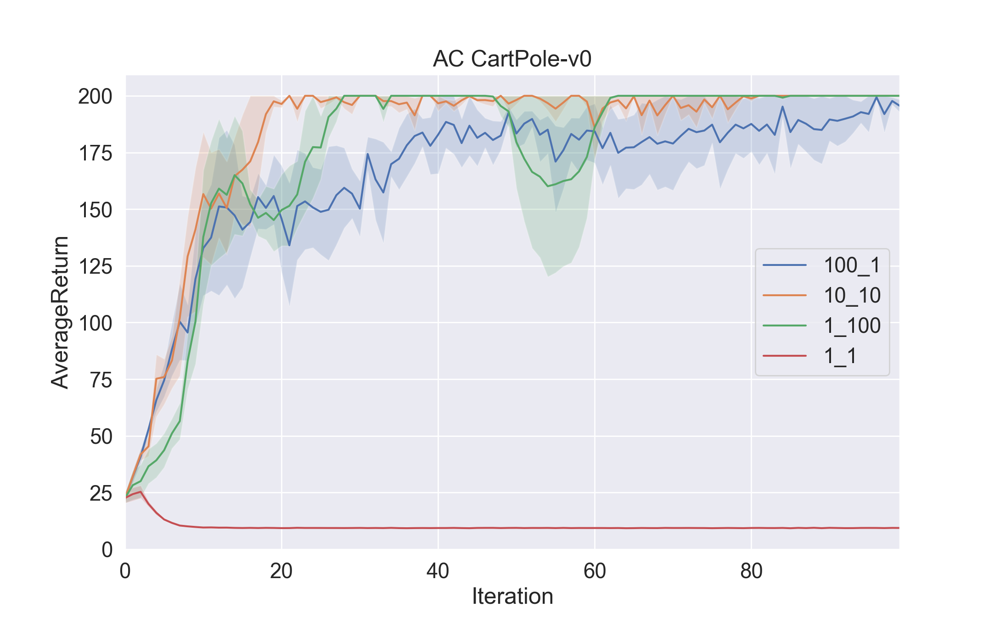
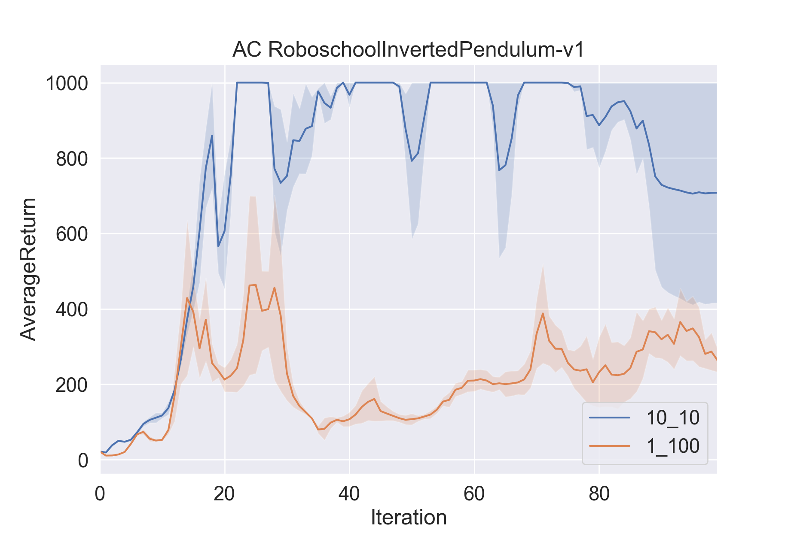
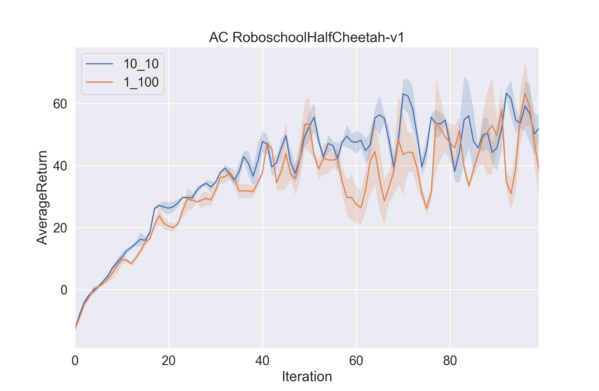
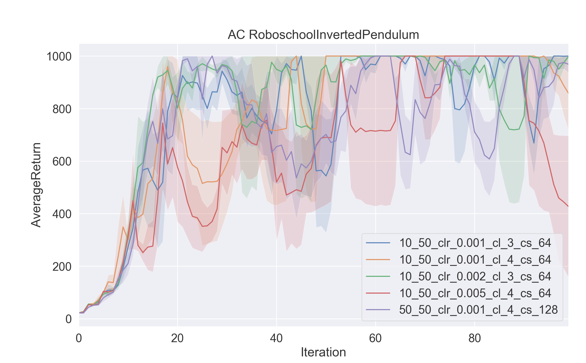
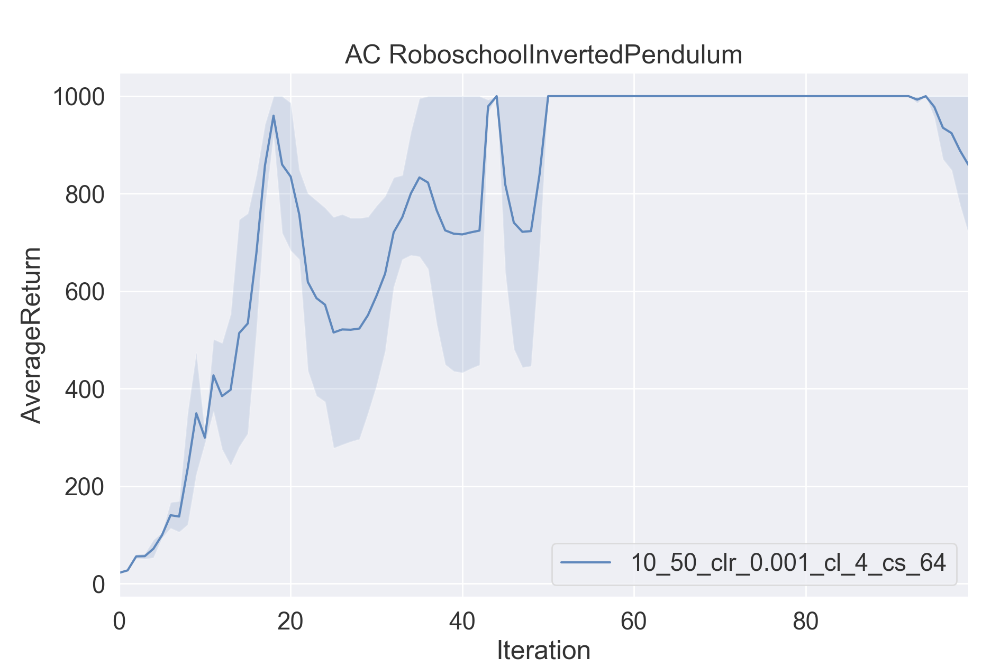

Work in progress......

# Part 1
## Question 1


## Question 2

We don't see an improvement for Double DQN over Vanilla DQN.

## Question 3
For this question, I was trying to modify the learning rate multiplier. doubling the learning rate did show some minor improvements, but on the contrary, a multiplier of 1.5 was inferior to both 1 and 2 multiplier, and therefor the results are not significant.



# Part 2
## Question 1
#### Running the experiment
```bash
python train_ac_f18.py CartPole-v0 -n 100 -b 1000 -e 3 --exp_name 1_1 -ntu 1 -ngsptu 1
python train_ac_f18.py CartPole-v0 -n 100 -b 1000 -e 3 --exp_name 100_1 -ntu 100 -ngsptu 1
python train_ac_f18.py CartPole-v0 -n 100 -b 1000 -e 3 --exp_name 1_100 -ntu 1 -ngsptu 100
python train_ac_f18.py CartPole-v0 -n 100 -b 1000 -e 3 --exp_name 10_10 -ntu 10 -ngsptu 10
```
#### Plotting the graphs
```bash
cd data
export RESULTS=`ls ./. | grep CartPole | sed ':a;N;$!ba;s/\n/ /g'`
python3 ../plot.py $RESULTS --value AverageReturn --title "AC CartPole-v0"
```


#### Results:
1. Experiment 1_1 got the worst results which is expected because it had the lowest number of gradient updates (lower by a factor of 100)
2. The two candidate settings for best results are experiments 10_10 and 1_100.
   10_10 converged faster than 100_1 and did not have the significant decrease in performance at iterations 50-60. On the contrary, 1_100 had converge to what seems to be a perfect policy around the 62nd iteration, and 10_10 reached it at around 80th iteration.  
10_10 seems more promising, but the fact that it takes longer to converge is a drawback. For that reason, we'll examine both 10_10 and 1_100 for the next task.


## Question 2 Use the best setting from the previous question to run InvertedPendulum and HalfCheetah
### RoboschoolInvertedPendulum-v1
#### Running the experiment
```bash
python train_ac_f18.py RoboschoolInvertedPendulum-v1 -ep 1000 --discount 0.95 -n 100 -e 3 -l 2 -s 64 -b 5000 -lr 0.01 --exp_name 1_100 -ntu 1 -ngsptu 100
python train_ac_f18.py RoboschoolInvertedPendulum-v1 -ep 1000 --discount 0.95 -n 100 -e 3 -l 2 -s 64 -b 5000 -lr 0.01 --exp_name 10_10 -ntu 10 -ngsptu 10
```
#### Plotting the graphs
```bash
cd data
export RESULTS=`ls ./. | grep RoboschoolInvertedPendulum | sed ':a;N;$!ba;s/\n/ /g'`
python3 ../plot.py $RESULTS --value AverageReturn --title "AC RoboschoolInvertedPendulum-v1"
RoboschoolInvertedPendulum
```


#### Results:
The settings of 10 target updates and then 10 gradient steps for each target (10_10) has far dominant the 100 gradient steps of a single target (1_100).

### RoboschoolHalfCheetah-v1
#### Running the experiment
```bash
python train_ac_f18.py RoboschoolHalfCheetah-v1 -ep 150 --discount 0.90 -n 100 -e 3 -l 2 -s 32 -b 30000 -lr 0.02 --exp_name 10_10 -ntu 10 -ngsptu 10
python train_ac_f18.py RoboschoolHalfCheetah-v1 -ep 150 --discount 0.90 -n 100 -e 3 -l 2 -s 32 -b 30000 -lr 0.02 --exp_name 1_100 -ntu 1 -ngsptu 100
```
#### Plotting the graphs
```bash
cd data
export RESULTS=`ls ./. | grep RoboschoolHalfCheetah | sed ':a;N;$!ba;s/\n/ /g'`
python3 ../plot.py $RESULTS --value AverageReturn --title "AC RoboschoolHalfCheetah-v1"
```
#### results


Both settings did not converge to a good result in 100 episodes. Either because the learning rate is too low, or we need longer training. 
I ran a single run of 500 episodes of the settings of 10 target updates and then 10 gradient steps for each target (10_10). there was no improvement.


## Bonus question
Running only RoboschoolInvertedPendulum-v1 because I did not manage to get RoboschoolHalfCheetah-v1 to converge
```bash
python train_ac_f18.py RoboschoolInvertedPendulum-v1 -ep 1000 --discount 0.95 -n 100 -e 3 -l 2 -s 64 -b 5000 -lr 0.01 -clr 0.001 -cl 4 -cs 64 -ntu 10 -ngsptu 50 --exp_name 10_50_clr_0.001_cl_4_cs_64
python train_ac_f18.py RoboschoolInvertedPendulum-v1 -ep 1000 --discount 0.95 -n 100 -e 3 -l 2 -s 64 -b 5000 -lr 0.01 -clr 0.005 -cl 4 -cs 64 -ntu 10 -ngsptu 50 --exp_name 10_50_clr_0.005_cl_4_cs_64
python train_ac_f18.py RoboschoolInvertedPendulum-v1 -ep 1000 --discount 0.95 -n 100 -e 3 -l 2 -s 64 -b 5000 -lr 0.01 -clr 0.001 -cl 3 -cs 64 -ntu 10 -ngsptu 50 --exp_name 10_50_clr_0.001_cl_3_cs_64
python train_ac_f18.py RoboschoolInvertedPendulum-v1 -ep 1000 --discount 0.95 -n 100 -e 3 -l 2 -s 64 -b 5000 -lr 0.01 -clr 0.002 -cl 3 -cs 64 -ntu 10 -ngsptu 50 --exp_name 10_50_clr_0.002_cl_3_cs_64
python train_ac_f18.py RoboschoolInvertedPendulum-v1 -ep 1000 --discount 0.95 -n 100 -e 3 -l 2 -s 64 -b 5000 -lr 0.01 -clr 0.002 -cl 4 -cs 128 -ntu 50 -ngsptu 50 --exp_name 50_50_clr_0.002_cl_3_cs_64

```
#### Plotting the graphs
```bash
cd data
export RESULTS=`ls ./. | grep RoboschoolInvertedPendulum | sed ':a;N;$!ba;s/\n/ /g'`
python3 ../plot.py $RESULTS --value AverageReturn --title "AC RoboschoolInvertedPendulum"
```


#### results
Attached below are two graphs:
1. A graph of some of the critic networks I tried for RoboschoolInvertedPendulum-v1


2. A graph of only the best network, with a critic network of 4 layers, 64 units in each layer, learning rate of 0.001. Each target were 
updated 10 times with 50 gradients steps for each calculated target.

